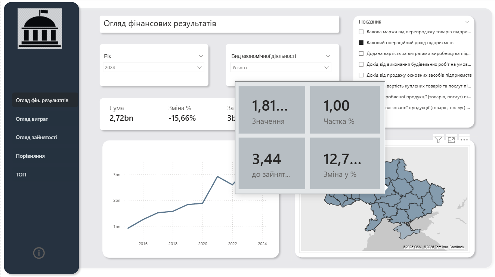

# 📊 Аналіз макроекономічних показників підприємств України (2015-2024)

## 🎯 Про проект
Цей проект є комплексним BI-рішенням для аналізу відкритих даних Державної служби статистики України. Головна мета дашборду — відійти від сухих абсолютних цифр та дослідити ефективність, динаміку витрат і стійкість українського бізнесу до економічних шоків (кризи 2020 та 2022 років) у розрізі регіонів та видів економічної діяльності.

**Інструменти:** Power BI, Power Query (M), DAX, Data Modeling.

Дані розділені на три основні групи: Фінансові результати, Витрати та Зайнятість. Періш три сторінки відображають огляд показників цих груп.


---

## 💡 Ключові бізнес-інсайти
Під час аналізу даних було виявлено наступні тенденції:
1. **Ефективність галузей:** Хоча Промисловість є лідером за кількістю зайнятих працівників, найвищу фінансову віддачу на одного працівника генерує галузь інформаційних технологій, а з 2023 року лідером є фінансовий сектор. Окрім цього фінансовий сектор виявився стійким до криз, зокрема після повіномаштабного вторгнення, бачимо значине збільшення показників ефективності.
2. **Стійкість до криз (2022 рік):** Незважаючи на загальне падіння фінансових результатів у 2022 році, регіони: Чернівецька обл., Львівська обл. та Закарпатська обл. показали найшвидше відновлення та позитивну динаміку (YoY) вже у 2023 році за рахунок релокації бізнесу.
3. **Приховані точки росту:** Якщо виключити м. Київ (який є абсолютним лідером за обсягами), найвищий відсоток приросту фінансових результатів стабільно демонструє Дніпропетровська область.

---

## 🏗 Архітектура та Моделювання даних
Дані були очищені та трансформовані за допомогою Power Query. Для забезпечення максимальної продуктивності (VertiPaq engine) була побудована класична **Star Schema (Схема Зірки)**. 

Замість однієї широкої таблиці, факти були розділені на три окремі сутності для уникнення дублювання та помилок в агрегації:
* **Таблиці фактів:** `Fact_Employment`, `Fact_Expenses`, `Fact_FinancialResults`.
* **Таблиці вимірів:** `Dim_Activity` (Галузі), `Dim_Region` (Регіони), `Dim_Date` (Календар).

 

---

## Особливості UI/UX:
Використання Bookmarks (Закладок) для динамічного перемикання між візуалізаціями (Тренд / Матриця) без перевантаження інтерфейсу.
Умовне форматування (Conditional Formatting) у матрицях для швидкого візуального пошуку аномалій (падіння/зростання).
Кастомна навігаційна панель.

---

## ⚙️ Технічна реалізація та DAX
У проекті реалізовано понад 25 мір (Measures) для глибокого аналізу. Використано функції Time Intelligence для розрахунку динаміки періодів.

**Приклад реалізованого DAX-коду (Розрахунок зміни фінансових результатів рік до року - YoY):**
```dax
Фін_Результати_Зміна_YoY_% = 
VAR CurrentValue = SUM('Fact_FinancialResults'[Значення])
VAR PreviousValue = 
    CALCULATE(
        SUM('Fact_FinancialResults'[Значення]),
        SAMEPERIODLASTYEAR('Dim_Date'[Date])
    )
RETURN
    DIVIDE(CurrentValue - PreviousValue, PreviousValue, 0)


